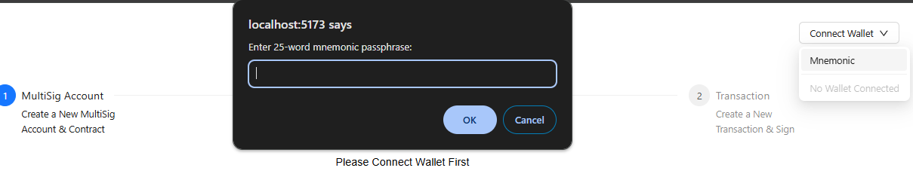
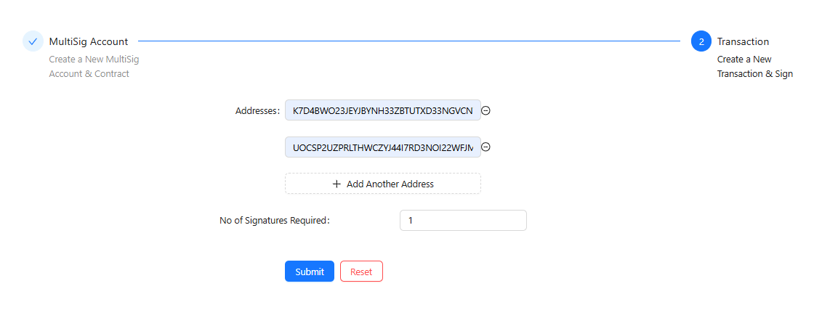
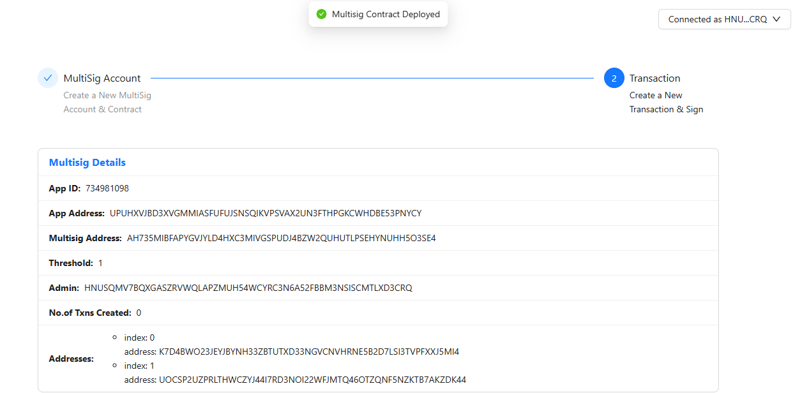
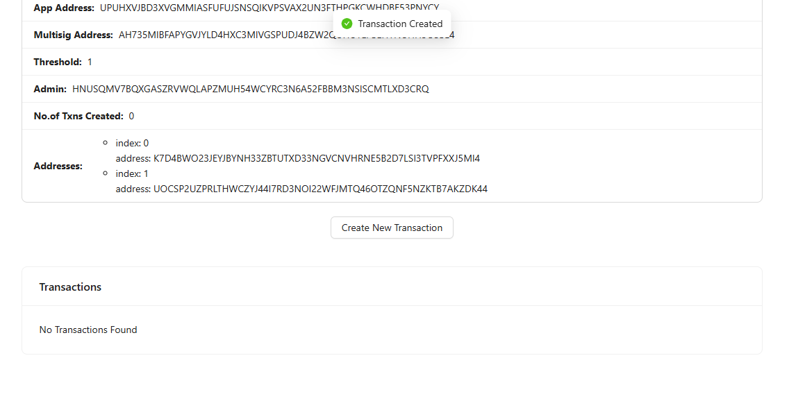
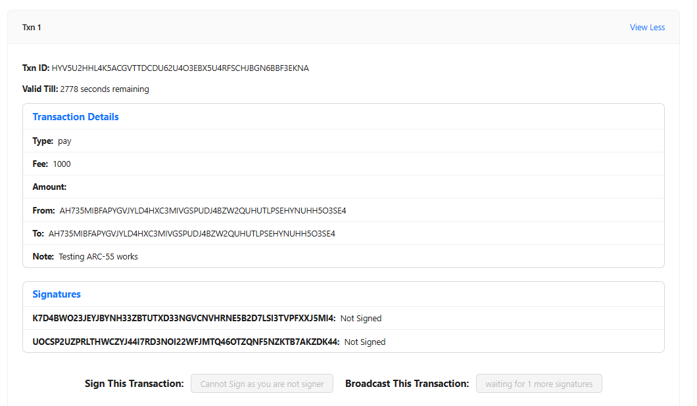
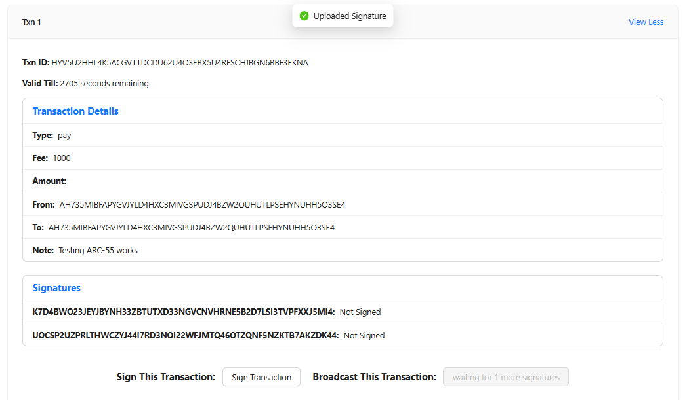
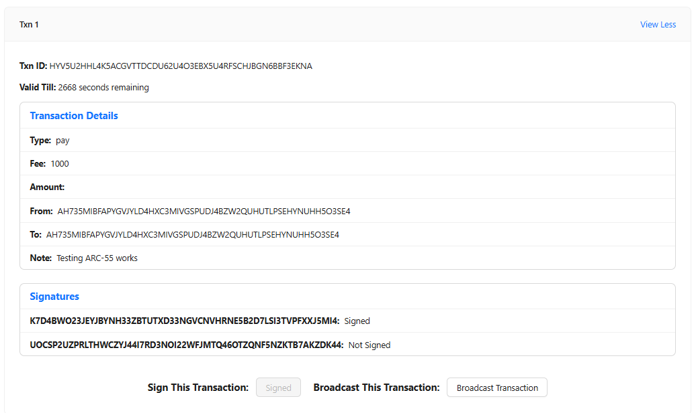
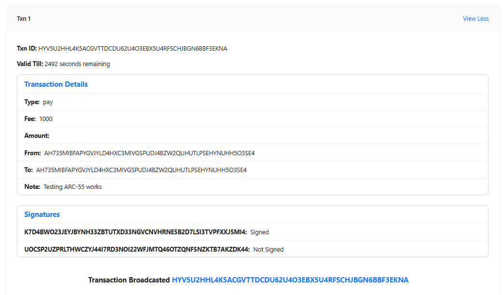

# ARC-55 Frontend: Algorand Multi-Signature Wallet Interface

A React-based frontend interface for creating and managing [ARC-55](https://github.com/algorandfoundation/ARCs/blob/main/ARCs/arc-0055.md) on-chain multi-signature storage contracts on the Algorand blockchain. This application enables users to create multi-signature wallets, propose transactions, collect signatures, and broadcast signed transactions.

This frontend Application is deployed in [Github Pages](https://satishgaxl.github.io/arc55-frontend/dist/).

## Table of Contents

- [Overview](#overview)
- [Features](#features)
- [Project Flow](#project-flow)
- [Technical Architecture](#technical-architecture)
- [Getting Started](#getting-started)
- [Usage](#usage)

## Overview

ARC-55 (Algorand Request for Comments 55) is a standard for on-chain multi-signature storage. This frontend application provides a user-friendly interface to interact with ARC-55 contracts on the Algorand blockchain. It allows users to create multi-signature accounts, propose transactions, collect signatures from authorized signers, and broadcast fully signed transactions to the network.

## Features

- Create multi-signature wallets with customizable threshold settings
- Create and propose new transactions for approval
- Sign proposed transactions using connected wallets
- Track signature collection progress
- Broadcast fully signed transactions
- View comprehensive transaction history
- Connect with various Algorand wallets

## Project Flow

### 1. Creating a Multi-Signature Wallet

1. Connect your wallet (using mnemonic) 

2. Add signer addresses (minimum 2)
3. Set signature threshold

4. Deploy multi-signature contract


### 2. Managing Transactions

- View account details (App ID, Address, Signers)
- Create new transactions

- Monitor transaction status


### 3. Signing and Broadcasting

- Sign pending transactions

- Track signature progress

- Broadcast completed transactions


## Technical Architecture

Built with:
- React + TypeScript
- Ant Design components
- algosdk
- @txnlab/use-wallet-react
- React Router

## Getting Started

### Prerequisites
- Node.js (v20+)
- npm/yarn
- Algorand node access

### Installation

```bash
# clone repository
git clone https://github.com/SatishGAXL/arc55-frontend.git
cd arc55-frontend

npm install

# Setup environment
cp .env.sample .env
# Configure .env variables

npm run dev
```

## Usage

### Create Wallet
1. Connect wallet
2. Add signer addresses
3. Set threshold
4. Deploy contract

### Sign Transactions
1. View pending transactions
2. Sign with connected wallet
3. Monitor signature progress

### Broadcast
1. Wait for threshold signatures
2. Broadcast transaction
3. View on explorer